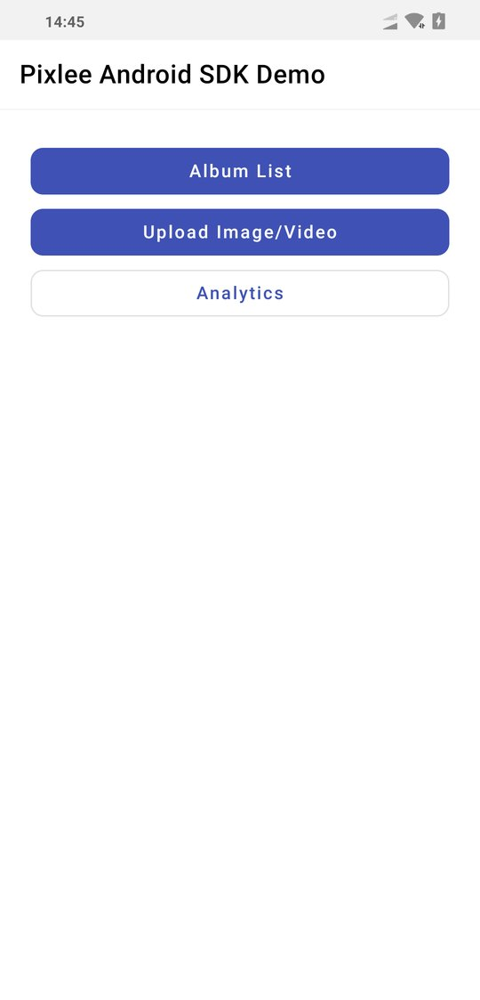
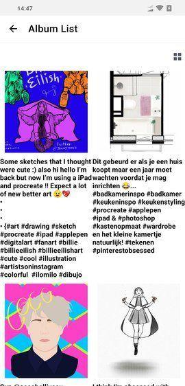
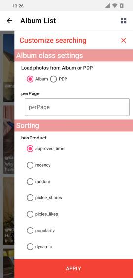
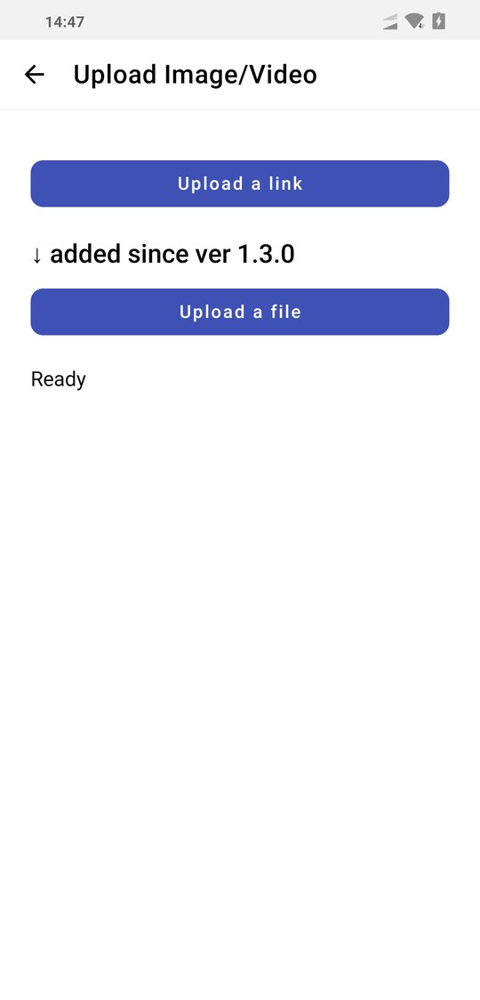
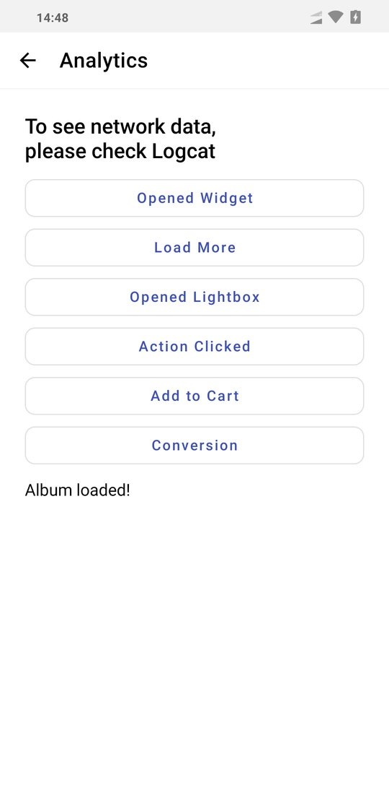
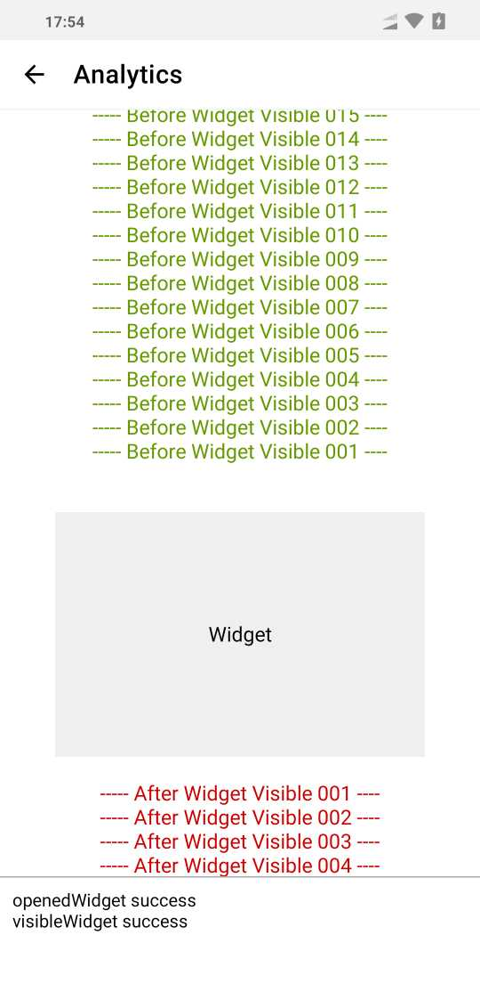

# pixlee-android-sdk
This SDK makes it easy for Pixlee customers to find and download Pixlee images and albums.  There's a native wrapper to the Pixlee album API for Android, and there's also a demo app showing how easy it is to drop in and customize a UI. This repo includes both the Pixlee Android SDK and an example project to show you how it's used.  

# Table of Content
- [Get Started with Demo App](#Get-Started-with-Demo-App)
- [Development Guide](#Development-Guide)
    - [Java](doc/JAVA.md)
    - [Kotlin](doc/KOTLIN.md)

# Get Started with Demo App
- The demo app included with this SDK are meant to be used in Android Studio to create a typical Android app.

- To help you get up and running quickly, we've also built an sample application featuring a grid view, list view, and detail view.  The adapters simply maintain an ArrayList of PXLBaseAlbum, which is updated via calls to `loadNextPageOfPhotos`.  Since the data source contains the full PXLPhoto object, you can easily customize your own widgets to display the desired images and text.  The sample also implements a scroll listener which times calls to `loadNextPageOfPhotos` to provide the endless scroll effect. 
An example of the proper usage of an opened lightbox event is also included in the sample app!
-    
-   

1. Add it in your root build.gradle at the end of repositories:
    ```
    allprojects {
        repositories {
            ...
            maven { url 'https://jitpack.io' }
        }
    }
    ```

2. Add the dependency
    ```
    dependencies {
            implementation 'com.github.pixlee:android-sdk:1.4.0-alpha05'
    }
    ```

3. Open .gitignore at the root of the project folder and Add 'pixleekey.properties' to the file
4. Generate **pixleekey.properties** at the root of the project folder
    - 
5. Fill the file with the example below and edit it with your own credentials, albumId and SKU.
pixleeAPIKey and pixleeSecretKey are in here (https://app.pixlee.com/app#settings/pixlee_api)
AlbumId and SKU available from the Pixlee dashboard).
    ```
    pixleeAPIKey=yours
    pixleeSecretKey=yours
    pixleeAlbumId=yours
    pixleeSKU=yours
    ```
    Example
    ```
    pixleeAPIKey=ccWQFNExi4gQjyNYpOEf
    pixleeSecretKey=b3b38f4322877060b2e4f390fd
    pixleeAlbumId=5984962
    pixleeSKU=35123
    ```

6. Run the project on an Android device


# Development Guide
### [Java](doc/JAVA.md)
### [Kotlin](doc/KOTLIN.md)
