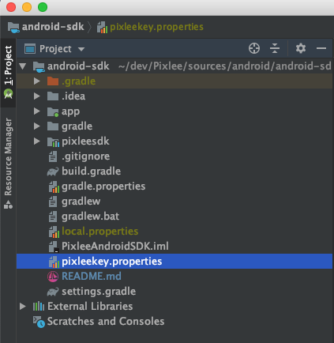

# pixlee-android-sdk
This SDK makes it easy for Pixlee customers to find and download Pixlee images and albums.  There's a native wrapper to the Pixlee album API for Android, and there's also a demo app showing how easy it is to drop in and customize a UI. This repo includes both the Pixlee Android SDK and an example project to show you how it's used.  

# Table of Content
- [Get Started with Demo App](#Get-Started-with-Demo-App)
- [Add the SDK to your App](#Add-the-SDK-to-your-App)
- [Initialize SDK](#Initialize-SDK)
    - [Register Pixlee credentials](#Register-Pixlee-credentials)
    - [Get PXLClient](#Get-PXLClient)
- [Album Features](#Album-Features)
    - [Get Photos of an Album](#Get-Photos-of-an-Album)
    - [Get Photos of a Product](#Get-Photos-of-a-Product)
    - [Get more Photos](#Get-more-Photos)
    - [Uploading Photos](#Uploading-Photos)
- [How to get image urls](#How-to-get-image-urls)
- [Album Analytics](#Album-Analytics)
    - [Opened Widget](#Opened-Widget)
    - [Load More](#Load-More)
    - [Opened Lightbox](#Opened-Lightbox)
    - [Action Clicked](#Action-Clicked)
- [Ecommerce Analytics](#Ecommerce-Analytics)
    - [Add To Cart](#Add-To-Cart)
    - [Conversion](#Conversion)
- Migration
    - [from 1.0.6 or older](doc/migration/1.0.6.md)

    

# Get Started with Demo App
- The demo app included with this SDK are meant to be used in Android Studio to create a typical Android app.

- To help you get up and running quickly, we've also built an sample application featuring a grid view, list view, and detail view.  The adapters simply maintain an ArrayList of PXLBaseAlbum, which is updated via calls to `loadNextPageOfPhotos`.  Since the data source contains the full PXLPhoto object, you can easily customize your own widgets to display the desired images and text.  The sample also implements a scroll listener which times calls to `loadNextPageOfPhotos` to provide the endless scroll effect. 
An example of the proper usage of an opened lightbox event is also included in the sample app!


1. Import this project into Android Studio
2. Open .gitignore at the root of the project folder and Add 'pixleekey.properties' to the file 
3. Generate **pixleekey.properties** at the root of the project folder
    -  
4. Fill the file with the example below and edit it with your own credentials, albumId and SKU.  
pixleeAPIKey and pixleeSecretKey are in here (https://app.pixlee.com/app#settings/pixlee_api)
AlbumId and SKU available from the Pixlee dashboard).
    ```
    pixleeAPIKey=yours
    pixleeSecretKey=yours
    pixleeAlbumId=yours
    pixleeSKU=yours
    ```
    Example
    ```
    pixleeAPIKey=ccWQFNExi4gQjyNYpOEf
    pixleeSecretKey=b3b38f4322877060b2e4f390fd
    pixleeAlbumId=5984962
    pixleeSKU=35123
    ```

4. Run the project on an Android device

# Add the SDK to your App
- import pixleesdk as a library project into your project
    1. Open your existing project in Android Studio
    2. Go to Import Module (File -> New -> Import Module)
    3. Enter the path of the pixlee-android-sdk directory
    4. Select the modules you would like to import and click Finish.
- [Google official doc: How to import a module](https://developer.android.com/studio/projects/add-app-module#ImportAModule)
   
# Initialize SDK
### You must do this before using this SDK!!
#### Register Pixlee credentials
- Before accessing any Pixlee API, you must initialize the `PXLClient`. To set the API key, call the static method initialize:
    ```
    // If you need only to use @Get APIs
    #!java
    
    PXLClient.initialize(<PIXLEE API KEY>);
    ```
    Or:
    ```
    // If you need to use both @Get and @Post APIs
    #!java
    
    PXLClient.initialize(<PIXLEE API KEY>, <PIXLEE SECRET KEY>);
    ```
#### Get PXLClient
- You can then use the singleton instance to make calls against the Pixlee API:
    ```
    #!java
    
    PXLClient client = PXLClient.getInstance(context);
    ```
## Album Features
### Initiation
- #### Option 1: Album    
    To load the photos in an album, you'll want to use the `PXLAlbum` class. Instantiate one with your album ID and client:
        
    ```
    #!java
    
    PXLBaseAlbum album = new PXLAlbum(<ALBUM ID>, client);
    ```
    Or:
    ```
    #!java
    
    PXLBaseAlbum album = new PXLAlbum(<ALBUM ID>, client.getBasicRepo(), client.getAnalyticsRepo());
    ```
- #### Option 2: Product    
    To load the photos in an Product album, you'll want to use the `PXLPdpAlbum` class. Instantiate one with your desired sku and client:
        
    ```
    #!java
    
    PXLBaseAlbum album = new PXLPdpAlbum(<SKU>, client);
    ```
    Or:
    ```
    #!java
    
    PXLBaseAlbum album = new PXLPdpAlbum(<SKU>, client.getBasicRepo(), client.getAnalyticsRepo());
    ```
#### Get more Photos
- You can then set sort and filter options if desired and use `loadNextPageOfPhotos` to kick off the async request.   
    ```
    #!java
    
    PXLAlbumFilterOptions filterOptions = new PXLAlbumFilterOptions();
    filterOptions.minTwitterFollowers = 1000;
    filterOptions.minInstagramFollowers = 2000;
    PXLAlbumSortOptions sortOptions = new PXLAlbumSortOptions();
    sortOptions.sortType = PXLAlbumSortType.DYNAMIC;
    sortOptions.descending = true;
    album.setPerPage(15);
    album.setFilterOptions(filterOptions);
    album.setSortOptions(sortOptions);
    album.loadNextPageOfPhotos(this);
    ```
- Each successive call of `loadNextPageOfPhotos` will load the next page of photos. Be sure to set all of your request options (filters, sort, etc) before calling `loadNextPageOfPhotos`.  See the source for more implementation details.
  Once an album has loaded photos from the server, it will instantiate `PXLBaseAlbum` objects that can be consumed by your UI. `PXLBaseAlbum` exposes all of the data for a photo available through the Pixlee API and offers several image url sizes depending on your needs.
    
#### Uploading Photos
- Prerequisite:
    - option 1: [Get Photos of an Album](#Get-Photos-of-an-Album)
    - option 2: [Get Photos of a Product](#Get-Photos-of-a-Product)
- Call the `uploadImage` method of the PXLBaseAlbum object you are using.
    ```
    #!java
    
    album.uploadImage("test", "test@test.com", "testuser", "https://timedotcom.files.wordpress.com/2019/05/drake-nba-finals-warning.jpg", true);
    ```
## How to get image urls
Some imageURL fields can be empty or null depending on its data's status. In order to get appropriate images, you can use this method.
```
#!java
photo.getUrlForSize(PXLPhotoSize.ORIGINAL)
photo.getUrlForSize(PXLPhotoSize.BIG)
photo.getUrlForSize(PXLPhotoSize.MEDIUM)
photo.getUrlForSize(PXLPhotoSize.THUMBNAIL)
```
    
## Album Analytics
#### Opened Widget
- To fire an opened widget event, simply call the `openedWidget` method of the PXLAlbum or PXLPdpAlbum AFTER data has been returned from the first call of the `loadNextPageOfPhotos` method, and an "Opened Widget" event will be fired containing all of the necessary analytics information.
See the onComplete function in GalleryFragment.java for an example.

    ```
    #!java
    
    album.openedWidget();
    ```

#### Load More
- To fire a load more event, simply call the `loadMore` method of the PXLAlbum or PXLPdpAlbum AFTER data has been returned from calls via the 'loadNextPageOfPhotos' method, a "Load More" analytics event will be fired containing all of the necessary analytics information.
See the onComplete function in GalleryFragment.java for an example.
- On calls to loadNextPageOfPhotos (except the first), a "Load More" analytics event will be fired automatically
    ```
    #!java
    
    album.loadMore();
    ```

#### Opened Lightbox
- To fire an opened ligtbox event, simply call the `openedLightbox` method of the PXLBaseAlbum that is being opened, and an "Opened Lightbox" event will be fired containing all of the necessary analytics information.

    ```
    #!java
    
    photo.openedLightbox(context);
    ```

#### Action Clicked
- To fire an action clicked event, simply call the `actionClicked` method of the PXLBaseAlbum that the action click is being driven from and pass in the URL of the link that the user is being redirected to.  An "Action Clicked" event will be fired containing all of the necessary analytics information.

    ```
    #!java
    
    photo.actionClicked("https://ca.puma.com/en/ca/pd/clyde-court-core-basketball-shoes/191712.html", context);
    ```
## Ecommerce Analytics
- initialize:
    ```
    #!java
    
    PXLAnalytics analytics = new PXLAnalytics(client);
    ```
    Or:
    ```
    #!java
    
    PXLAnalytics analytics = new PXLAnalytics(client.getAnalyticsRepo());
    ```
    
#### Add To Cart
- To fire an Add To Cart event, simply call the `addToCart` method of the PXLAnalytics object with the necessary parameters, and an "Add To Cart" event will be fired containing all of the necessary analytics information.
The parameters for this method are:
    - [Required] sku  (String)
    - [Required] price (String)
    - [Required] quantity (Integer)
    - [Optional] currency (String)

    ```
    #!java
    analytics.addToCart("sku123", "123", 4);
    ```

#### Conversion
- To fire a Conversion event, simply call the `conversion` method of the PXLAnalytics object with the necessary parameters, and a "Conversion" event will be fired containing all of the necessary analytics information.
The parameters for this method are:
    - [Required] cartContents  (ArrayList<HashMap<String, Object>>)
    - [Required] cartTotal (String)
    - [Required] cartTotalQuantity (Integer)
    - [Optional] orderId (String)
    - [Optional] currency (String)
    
    ```
    #!java
    
    ArrayList<HashMap<String, Object>> cartContents = new ArrayList();
    HashMap<String, Object> cart1 = new HashMap();
    cart1.put("price", "123");
    cart1.put("product_sku", "test123");
    cart1.put("quantity", "4");
    
    cartContents.add(cart1);
    analytics.conversion(cartContents, "123", 4);
    ```

# License
pixlee-android-sdk is available under the MIT license.
