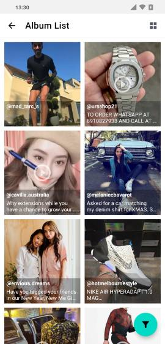

# pixlee-android-sdk
This SDK makes it easy for Pixlee customers to find and download Pixlee images and albums.  There's a native wrapper to the Pixlee album API for Android, and there's also a demo app showing how easy it is to drop in and customize a UI. This repo includes both the Pixlee Android SDK and an example project to show you how it's used.  


### Notice: please be aware of these terms in the document. 
- the word 'content' is used in the documentation. this means a photo or video.
- The PXLPhoto class represents a piece of content, which can be a photo or video

# Table of Content
- [Get Started](#Get-Started)
- [Run the Demo App](#Run-the-Demo-App)
- [Development Guide](#Development-Guide)
    - [Java](doc/JAVA.md)
    - [Kotlin](doc/kotlin/INDEX.md)

# Get Started
- ### Add gradle dependencies
    1. Add it in your root build.gradle at the end of repositories:
        ```gradle
        allprojects {
            repositories {
                ...
                maven { url 'https://jitpack.io' }
            }
        }
        ```
    1. Add the dependency
        - The latest $pixleeSDK is [](https://jitpack.io/#pixlee/android-sdk)
        ```gradle
        dependencies {
                implementation 'com.github.pixlee:android-sdk:$pixleeSDK

                // (Optional) if you need to use PXLLoading, add this.
                implementation "com.airbnb.android:lottie:3.4.1"
        }
        ```

# Run the Demo App
- The demo app included with this SDK are meant to be used in Android Studio to create a typical Android app.
- To help you get up and running quickly, we've built this demo featuring a RecyclerView with LinearLayoutManager and GridLayoutManager and a few UI components.
- UI components demonstrated in the demo can be customize by adding arguments to the views simple.
- API calls being fired via Kotlin.coroutines are in the demo. 
- video: https://www.loom.com/share/37fb674d3cb348d48c3479b67a9bc2aa
-    
-   
1. Open .gitignore at the root of the project folder and Add 'pixleekey.properties' to the file
1. Generate **pixleekey.properties** at the root of the project folder
    - 
1. Fill the file with the example below and edit it with your own credentials, albumId and SKU.
pixleeAPIKey and pixleeSecretKey are in here (https://app.pixlee.com/app#settings/pixlee_api)
AlbumId and SKU available from the Pixlee dashboard).
    ```properties
    pixleeAPIKey=yours
    pixleeSecretKey=yours
    pixleeAlbumId=yours
    pixleeSKU=yours
    ```
    Example
    ```properties
    pixleeAPIKey=ccWQFNExi4gQjyNYpOEf
    pixleeSecretKey=b3b38f4322877060b2e4f390fd
    pixleeAlbumId=5984962
    pixleeSKU=35123
    ```
1. Run the project on an Android device

# Development Guide
### [Java](doc/JAVA.md)
### [Kotlin](doc/kotlin/INDEX.md)
