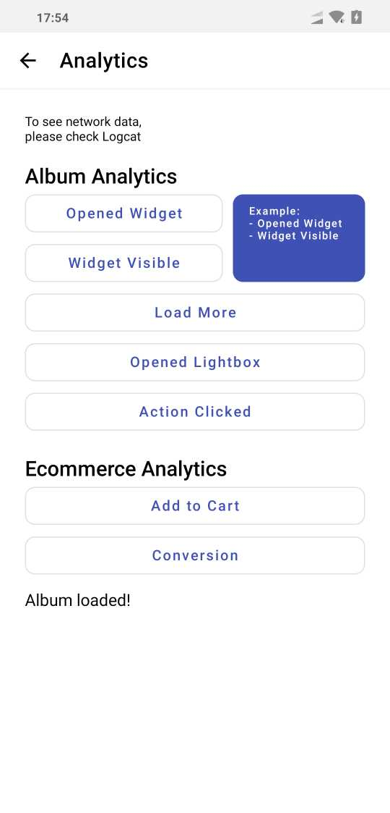

# pixlee-android-sdk
This SDK makes it easy for Pixlee customers to find and download Pixlee images and albums.  There's a native wrapper to the Pixlee album API for Android, and there's also a demo app showing how easy it is to drop in and customize a UI. This repo includes both the Pixlee Android SDK and an example project to show you how it's used.  


### Notice: please be aware of these terms in the document. 
- the word 'content' is used in the documentation. this means a photo or video.
- The PXLPhoto class represents a piece of content, which can be a photo or video

# Table of Content
- [Quick Start](#Quick-Start)
- [Run the Demo App](#Run-the-Demo-App)
- [Development Guide](#Development-Guide)
    - [Java](doc/JAVA.md)
    - [Kotlin](doc/kotlin/INDEX.md)

# Quick Start
- ### Add gradle dependencies
    1. Add it in your root build.gradle at the end of repositories:
        ```gradle
        allprojects {
            repositories {
                ...
                maven { url 'https://jitpack.io' }
            }
        }
        ```
    1. Add the dependency
        - The latest $pixleeSDK is [](https://jitpack.io/#pixlee/android-sdk)
        ```gradle
        dependencies {
                implementation 'com.github.pixlee:android-sdk:$pixleeSDK

                // (Optional) if you need to use PXLLoading, add this.
                implementation "com.airbnb.android:lottie:3.4.1"
        }
        ```

    1. Initalize SDK
        - In your Application level, you need to initialize your SDK to make sure the SDK get essential data before using its features.
        ```kotlin
        #!kotlin
        class AppApplication: Application() {
            override fun onCreate() {
                super.onCreate()
                // set credentials for the SDK
                PXLClient.initialize("Your Pixlee api key", Your Pixlee secret key"")

                // (Optional) if you use UI components and want
                // to let PXLPhotosView, PXLPhotoRecyclerViewInGrid, PXLPhotoRecyclerView and PXLPhotoProductView
                // fire 'openedWidget', 'widgetVisible' and 'openedLightbox' analytics events, use this.
                PXLClient.autoAnalyticsEnabled = true

                // (Optional) if you use multi-region, you can set your region id here to get photos, a photo, and products available in the region.
                val regionId:Int? = null // replace this value with yours
                PXLClient.regionId = regionId
            }
        }
        ```
    1. Load your album photos using PXLPhotosView (Similar to Widget)
        - Using PXLPhotosView, you can load your album's photos.
        - res/layout/list_layout.xml
            ```xml
            #!xml
            ...
            <com.pixlee.pixleesdk.ui.widgets.list.v2.PXLPhotosView
                android:id="@+id/pxlPhotosView"
                android:layout_width="match_parent"
                android:layout_height="match_parent"/>
            ...
            ```
        - In Activity
            ```kotlin
            #!kotlin
            class SimpleListActivity : AppCompatActivity() {
                public override fun onCreate(savedInstanceState: Bundle?) {
                    super.onCreate(savedInstanceState)
                    setContentView(R.layout.list_layout)

                    pxlPhotosView.viewTreeObserver.addOnGlobalLayoutListener(object : ViewTreeObserver.OnGlobalLayoutListener {
                        override fun onGlobalLayout() {
                            try {
                                if (pxlPhotosView == null)
                                    return

                                initiateList((pxlPhotosView.measuredHeight / 2).toInt())

                                pxlPhotosView.viewTreeObserver.removeOnGlobalLayoutListener(this)
                            } catch (e: Exception) {
                                e.printStackTrace()
                            }

                        }
                    })
                }

                private fun initiateList(cellHeightInPixel: Int) {
                    // you can customize color, size if you need
                    pxlPhotosView.initiate(
                            widgetTypeForAnalytics = "your_widget_type",
                            viewType = PXLPhotosView.ViewType.List(),
                            cellHeightInPixel = cellHeightInPixel,
                            params = PXLKtxBaseAlbum.Params(
                                    // album images
                                    searchId = PXLKtxBaseAlbum.SearchId.Album("your album number"),
                                    filterOptions = PXLAlbumFilterOptions(),
                                    sortOptions = PXLAlbumSortOptions().apply {
                                        sortType = PXLAlbumSortType.RECENCY
                                        descending = false
                                    }
                            ),
                            loadMoreTextViewStyle = TextViewStyle().apply {
                                text = "Load More"
                                textPadding = TextPadding(0, 22.px.toInt(), 0, 22.px.toInt())
                                size = 18.px
                                color = Color.BLACK
                            },
                            configuration = PXLPhotoView.Configuration().apply {
                                pxlPhotoSize = PXLPhotoSize.MEDIUM
                                imageScaleType = ImageScaleType.CENTER_CROP
                            },
                            onPhotoClickedListener = { view, photoWithImageScaleType ->
                                // TODO: you can add your business logic here
                                ViewerActivity.launch(this, photoWithImageScaleType)
                                Toast.makeText(this, "onItemClickedListener", Toast.LENGTH_SHORT).show()
                            }
                    )
                }
            }
            ```
    1. Display a photo and products (similar to Lightbox)
        - res/layout/viewer_layout.xml
            ```xml
            #!xml
            ...
            <com.pixlee.pixleesdk.ui.widgets.PXLPhotoProductView
                android:id="@+id/pxlPhotoProductView"
                android:layout_width="match_parent"
                android:layout_height="match_parent"/>
            ...
            ```

        - Activity
            ```kotlin
            #!kotlin
            class ViewerActivity : AppCompatActivity() {
                override fun onCreate(savedInstanceState: Bundle?) {
                    super.onCreate(savedInstanceState)
                    setContentView(R.layout.viewer_layout)
                    // set a full screen mode
                    PXLViewUtil.expandContentAreaOverStatusBar(this)
                    val item: PhotoWithVideoInfo? = intent.getParcelableExtra("photoWithVideoInfo")
                    init(item)
                }

                fun init(item: PhotoWithVideoInfo) {
                    // this is an example of changing ImageScaleType
                    item.configuration.imageScaleType = ImageScaleType.FIT_CENTER

                    // give a padding to the top as much as the status bar's height
                    pxlPhotoProductView.addPaddingToHeader(0, PXLViewUtil.getStatusBarHeight(this), 0, 0)

                    // by passing lifecycle to pxlPhotoProductView, the SDK will automatically start and stop the video
                    pxlPhotoProductView.useLifecycleObserver(lifecycle)

                    // set your ui settings
                    pxlPhotoProductView
                            .setContent(photoInfo = item,
                                    headerConfiguration = PXLPhotoProductView.Configuration().apply {
                                        backButton = PXLPhotoProductView.CircleButton().apply {
                                            onClickListener = {
                                                // back button's click effect
                                                onBackPressed()
                                            }
                                        }
                                        muteCheckBox = PXLPhotoProductView.MuteCheckBox().apply {
                                            onCheckedListener = {

                                            }
                                        }
                                    },
                                    configuration = ProductViewHolder.Configuration().apply {
                                        circleIcon = ProductViewHolder.CircleIcon().apply {
                                            icon = R.drawable.outline_shopping_bag_black_24
                                            iconColor = Color.DKGRAY
                                            backgroundColor = ContextCompat.getColor(this@ViewerActivity, R.color.yellow_800)
                                            padding = 5.px.toInt()
                                        }
                                        mainTextStyle = TextStyle().apply { size = 14.px }
                                        subTextStyle = TextStyle().apply { size = 12.px }
                                        priceTextStyle = CurrencyTextStyle().apply {
                                            defaultCurrency = "EUR" // or null
                                            leftText = TextStyle().apply { size = 24.px }
                                            rightText = TextStyle().apply { size = 14.px }
                                        }
                                    },
                                    onProductClicked = {
                                        Toast.makeText(this, "product clicked, product id: ${it.id}", Toast.LENGTH_SHORT).show()
                                        startActivity(Intent(Intent.ACTION_VIEW, Uri.parse(it.link.toString())))
                                    })
                }

                companion object {
                    // start video view with a photo data
                    fun launch(context: Context, pxlPhoto: PhotoWithVideoInfo?) {
                        val i = Intent(context, ViewerActivity::class.java)
                        i.putExtra("photoWithVideoInfo", pxlPhoto)
                        context.startActivity(i)
                    }
                }
            }
            ```

# Run the Demo App
- The demo app included with this SDK are meant to be used in Android Studio to create a typical Android app.
- To help you get up and running quickly, we've built this demo featuring a RecyclerView with LinearLayoutManager and GridLayoutManager and a few UI components.
- UI components demonstrated in the demo can be customize by adding arguments to the views.
- API calls being fired via Kotlin.coroutines are in the demo. 
- video: https://www.loom.com/share/37fb674d3cb348d48c3479b67a9bc2aa
-    
-   
1. Open .gitignore at the root of the project folder and Add 'pixleekey.properties' to the file
1. Generate **pixleekey.properties** at the root of the project folder
    - 
1. Fill the file with the example below and edit it with your own credentials, albumId and SKU.
pixleeAPIKey and pixleeSecretKey are in here (https://app.pixlee.com/app#settings/pixlee_api)
AlbumId and SKU available from the Pixlee dashboard).
    ```properties
    pixleeAPIKey=yours
    pixleeSecretKey=yours
    pixleeAlbumId=yours
    pixleeSKU=yours
    ```
    Example
    ```properties
    pixleeAPIKey=ccWQFNExi4gQjyNYpOEf
    pixleeSecretKey=b3b38f4322877060b2e4f390fd
    pixleeAlbumId=5984962
    pixleeSKU=35123
    ```
1. Run the project on an Android device
    - /app: complex codes for thoes that want to have more control or customization options
    - /simpleapp: simple sample codes for those looking for basic features

# Development Guide
### [Java](doc/JAVA.md)
### [Kotlin](doc/kotlin/INDEX.md)
